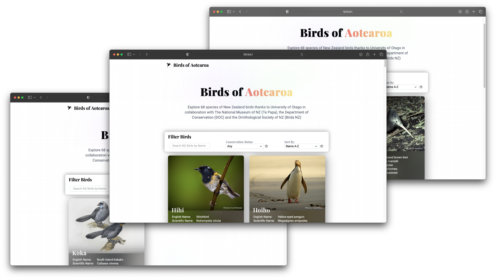
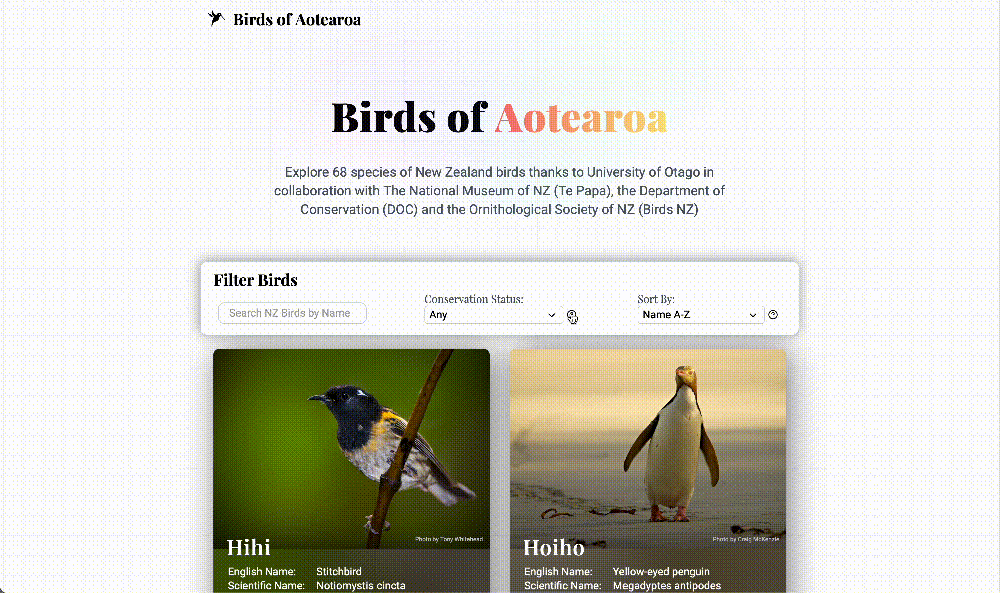

<br />
<p align="center">
    <h1 align="center"> NZ Birds Front End </h1>
    <h6 align="center">COSC203 Web, Databases & Networks - James Robiony-Rogers : 5793901</h6>

  <p align="center">
   Front end web application for a dataset of New Zealand birds.
  </p>
</p>

___

## Overview 

This website was created as part of my COSC203 Web, Databases & Networks course at the University of Otago. The website is the front end for a database of New Zealand birds. The website allows users to search for birds by name, filter by conservation status, and sort via a variety of filters. 

The website is built using vanilla HTML, CSS and JavaScript and is hosted on the University of Otago's servers which can be found [here][Pages-URL]

## Links
- **Git Repository:** [Altitude][Git-Repo-URL]
- **Website:** [Hosted using Gitlab Pages][Pages-URL]

## Built With

* **Data Provided By:** [Birds New Zealand](https://robja577.cspages.otago.ac.nz/newzealandbirds/)
* **Library:** [SweetAlert2](https://sweetalert2.github.io)


## File Tree 
- `assets` - Contains svg icons
- `data` - Contains the JSON file of the bird data 
- `data/images` - Contains the images of the birds
- `readme_assets` - Contains the images used in the README 


### Running Locally

1. Clone the repo using Git
```sh
git clone https://github.com/JamesRobionyRogers/NZBirds-FrontEnd.git
```
2. Open the project in VS Code & start up a live server  

<!-- USAGE EXAMPLES -->
## View Project

<div align="center">
   
</div>


<!-- Use this space to show useful examples of how a project can be used. Additional screenshots, code examples and demos work well in this space. You may also link to more resources. -->

## Unresolved Issues

As far as I am aware, there are no unresolved issues with the website.

## Enhancements / Extra Features 

- **Help Modal** - In order to keep a minimal design I opted to hide the conservation status key behind the `?` icon next to the filter. The help icon is also equipped with a CSS tooltip to improve the UX. I used the SweetAlert2 library for the modal for the modal. 

  

## Further Development  

Here are some of the features that I would like to add to the project in the future:

- [ ] Add a backend to the project to allow users to add their own birds to the database.
- [ ] Add a sightings page to allow users to add sightings of birds to the database.
- [ ] Toggling between light and dark mode.


<!--  -->

[Pages-URL]: https://robja577.cspages.otago.ac.nz/newzealandbirds/
[Git-Repo-URL]: https://altitude.otago.ac.nz/robja577/newzealandbirds